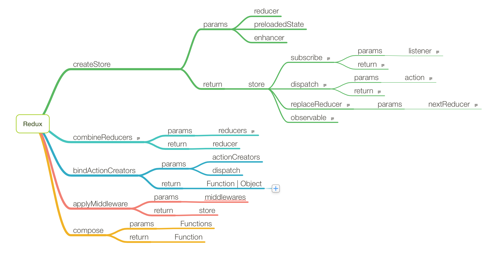

# createStore
用来创建一个Redux Store。一个APP应该只有一个store。

Redux 中提供了如上入的方法：
1. createStore
2. combineReducers
3. bindActionCreators
4. applyMiddleware
5. compose

## createStore
createStore是用来创建Store的方法

参数：
1. reducer
2. preloadedState(初始化的state)
3. enhancer(store增强，例如中间件)

返回：

返回一个redux store

这个store中包含一个可读的state、dispatch方法、subscribe方法和replaceReducer方法

### subscribe
监听改变事件，可以绑定多个监听回调
```
function subscribe(listener) {
    if (typeof listener !== 'function') {
      throw new Error('Expected listener to be a function.');
    }

    var isSubscribed = true;

    ensureCanMutateNextListeners();
    nextListeners.push(listener);

    return function unsubscribe() {
      if (!isSubscribed) {
        return;
      }

      isSubscribed = false;

      ensureCanMutateNextListeners();
      var index = nextListeners.indexOf(listener);
      nextListeners.splice(index, 1);
    };
  }
```

参数：
1. listener(回调函数)

返回：

返回一个移除这个监听事件的函数


### dispatch
用来分配操作，并且改变状态只能通过dispatch来执行。
会循环所有的listeners并执行。
```
function dispatch(action) {
    if (!isPlainObject(action)) {
      throw new Error('Actions must be plain objects. ' + 'Use custom middleware for async actions.');
    }

    if (typeof action.type === 'undefined') {
      throw new Error('Actions may not have an undefined "type" property. ' + 'Have you misspelled a constant?');
    }

    if (isDispatching) {
      throw new Error('Reducers may not dispatch actions.');
    }

    try {
      isDispatching = true;
      currentState = currentReducer(currentState, action);
    } finally {
      isDispatching = false;
    }

    var listeners = currentListeners = nextListeners;
    for (var i = 0; i < listeners.length; i++) {
      var listener = listeners[i];
      listener();
    }

    return action;
  }
```
参数:
1. action(是一个纯对象，来说明要改变什么)

返回:

返回传入的action

### replaceReducer
重写当前使用的reducer。如果你想执行一些动态的reducers时可以使用，或者热加载。
```
function replaceReducer(nextReducer) {
    if (typeof nextReducer !== 'function') {
      throw new Error('Expected the nextReducer to be a function.');
    }

    currentReducer = nextReducer;
    dispatch({ type: ActionTypes.INIT });
  }
```


